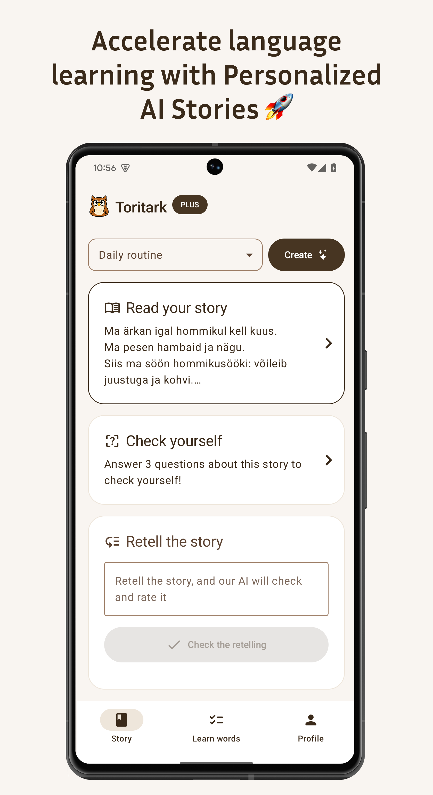
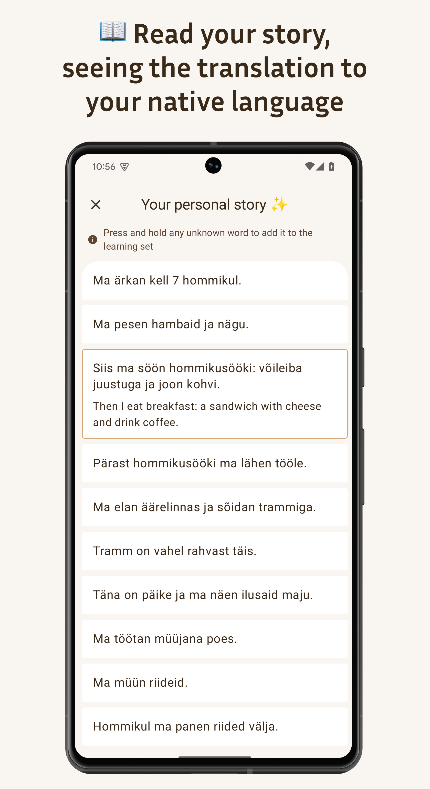
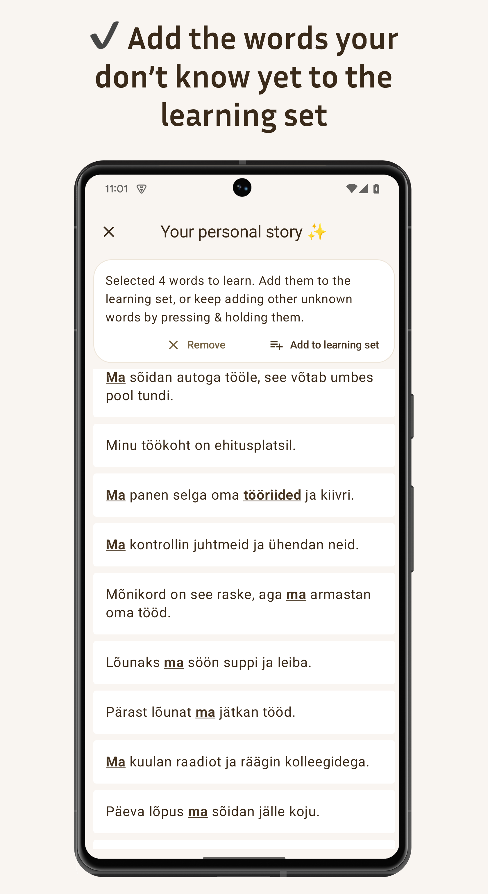
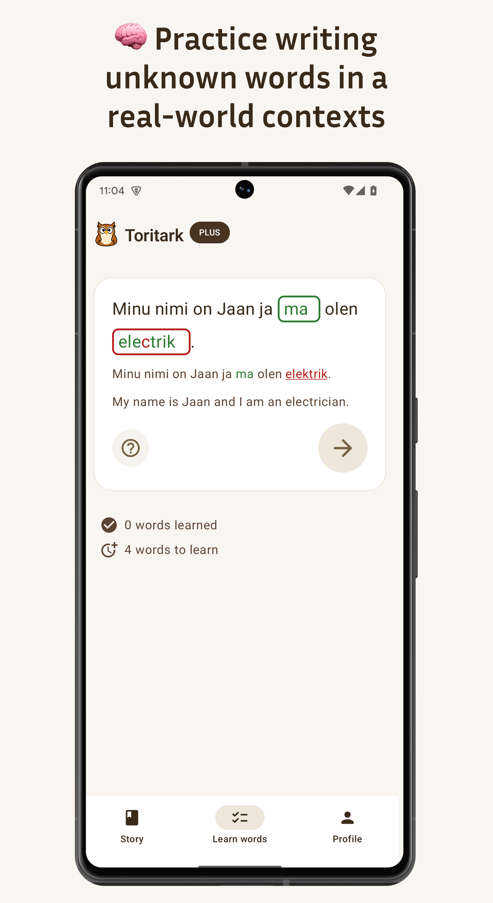
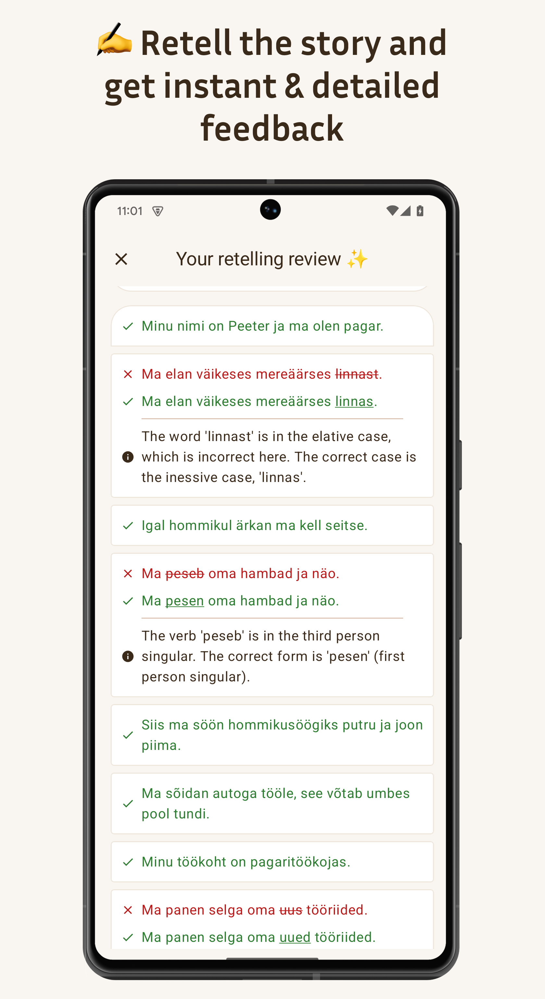
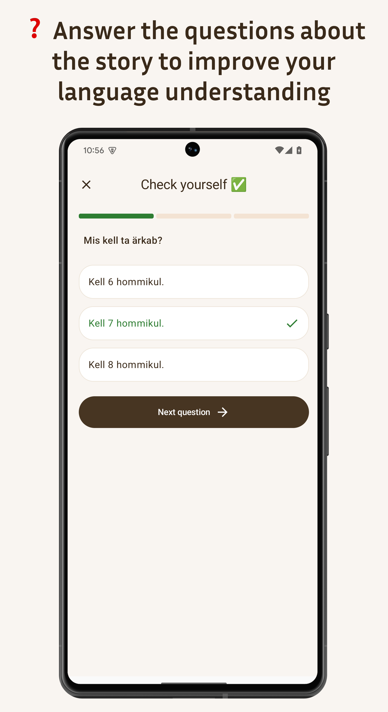

# Toritark

A language learning application that helps users learn languages through text stories.

     

## 🌐 Supported languages

🇬🇧 🇪🇸 🇩🇪 🇫🇷 🇮🇹 🇷🇺 🇺🇦 🇵🇱 🇨🇿 🇷🇸 🇵🇹 🇫🇮 🇸🇪 🇪🇪 🇱🇻 🇱🇹 🇱🇺

## 🚧 Work in Progress

This project is currently a Work in Progress. It's being developed as an MVP with the goal of rapid development.

That's why:

- There are no Compose optimizations performed yet. Will be added after the basic implementation is complete.
- Single module. However, it's being developed keeping in mind future multi-module support, so most of the code is
  ready to be split into modules by copy-paste.
- No separation to Data/Domain level models. Will add later, for now using models from Data layer everywhere (and
  sometimes Presentation-level models).
- Commits are that huge.
- No tests. The most important ATM part - backend - is fully covered by tests, but not the client. Will add tests later.

## 📱 Platform Support

- ✅ Android (current)
- 🔜 iOS (planned, soon — right after Android)
- 🌐 Web (planned, much later)

## 📋 Features

- Language selection (native and learning)
- Interactive stories for language learning
- Word and sentence learning tools
- Progress tracking

## 🔧 Technical Details

- **Kotlin Multiplatform** - Cross-platform development
- **Compose Multiplatform** - Cross-platform UI
- **Material 3** - UI
- **Koin** - DI
- **Ktor** - HTTP client
- **Room** - Cross-platform SQLite ORM
- **Kotlinx Serialization** - JSON serialization/deserialization
- **Kotlinx Coroutines** - Asynchronous programming
- **Kotlinx DateTime** - Date and time handling
- **Coil** - Image loading library
- **Firebase Auth** - Authentication service (Google & Apple sign in)
- **RevenueCat** - IAP
- **Appodeal** - Ads
- **KSoup** - HTML parsing (for text highlighting)
- **Django** - Backend (closed-source)

## ⚠️ Requirements

This application requires a backend server to run, which is closed-source.

## 🧪 Testing

Tests will be added later as this is an MVP focused on rapid development.

## 📜 License

Attribution-NonCommercial-ShareAlike 4.0 International
