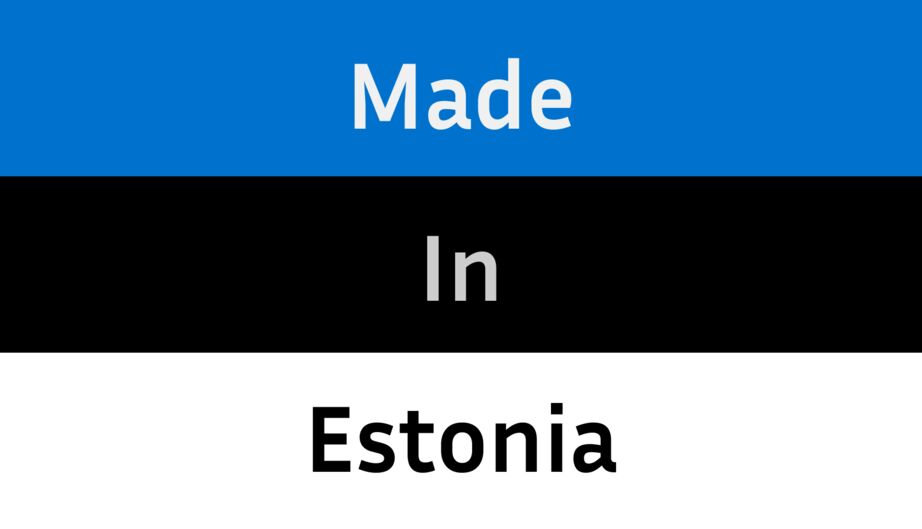
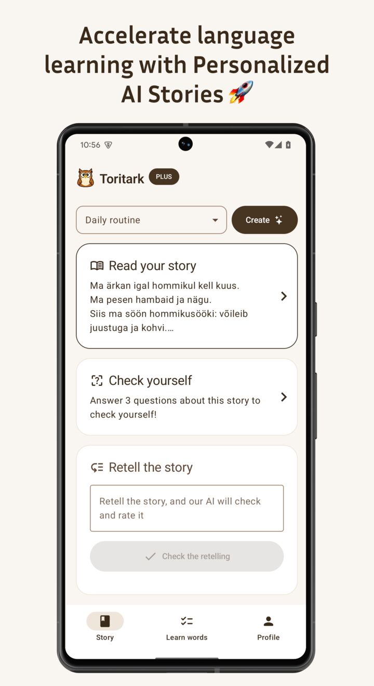
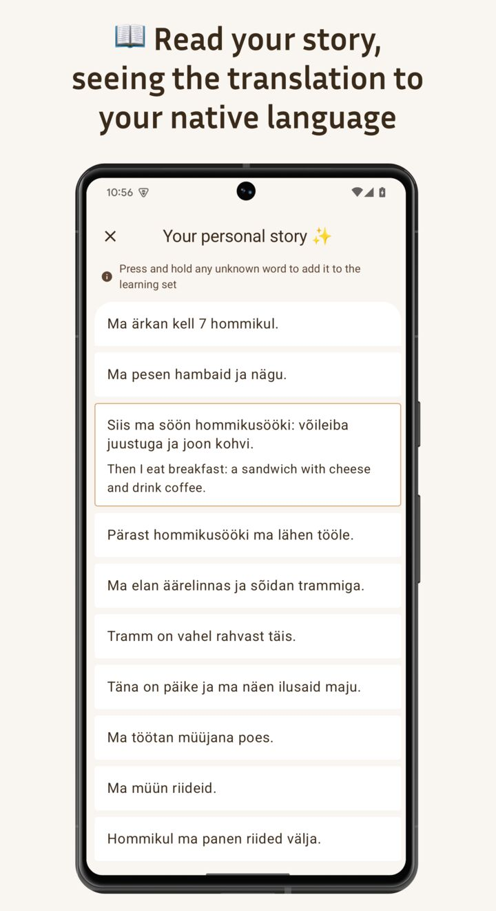
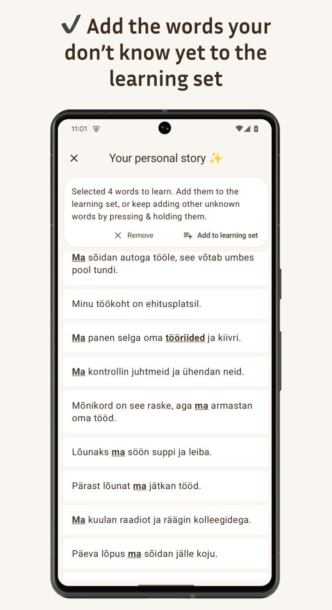
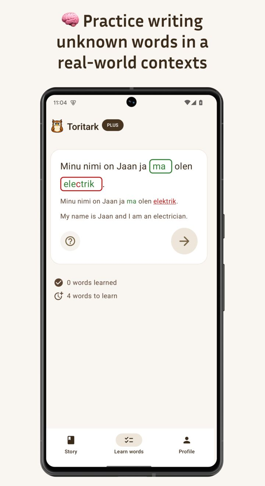
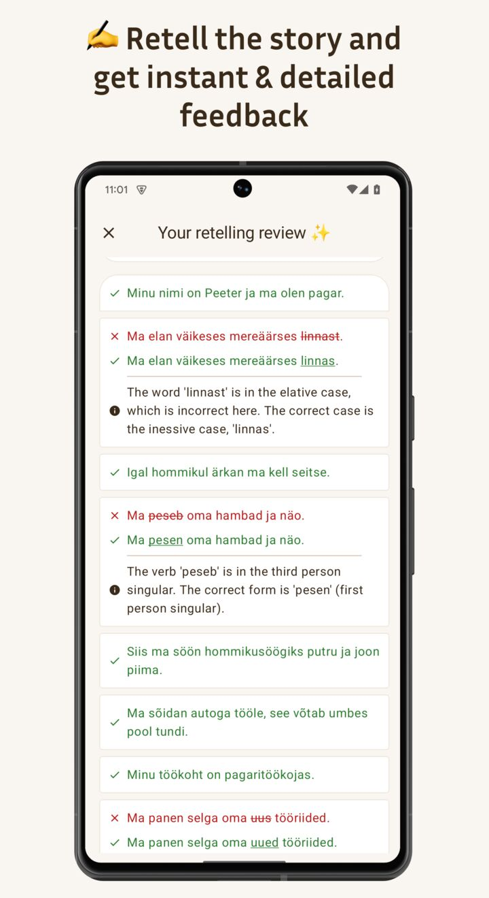
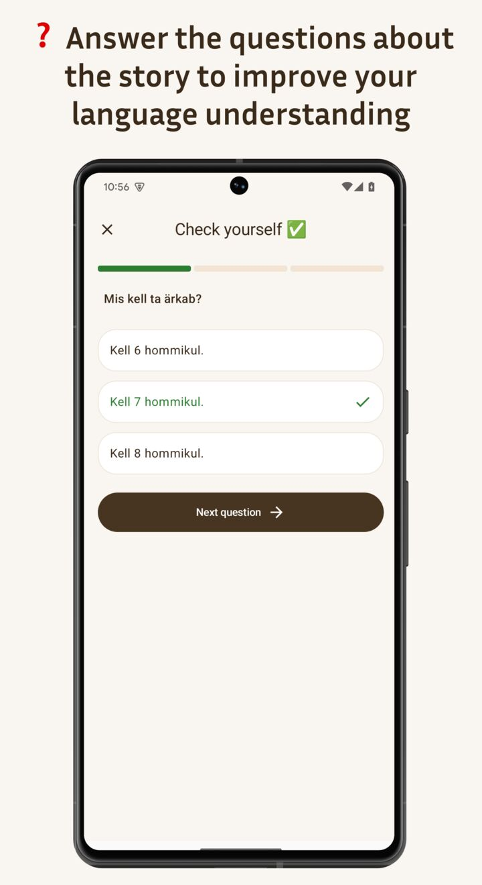

# Toritark

A language learning application that helps users learn languages through text stories.

  

     

## 🌐 Supported languages

🇬🇧 🇪🇸 🇩🇪 🇫🇷 🇮🇹 🇷🇺 🇺🇦 🇵🇱 🇨🇿 🇷🇸 🇵🇹 🇫🇮 🇸🇪 🇪🇪 🇱🇻 🇱🇹 🇱🇺

## 🚧 Work in Progress

This project is currently a Work in Progress. It's being developed as an MVP with the goal of rapid development.

That's why:

- There are no Compose optimizations performed yet. Will be added after the basic implementation is complete.
- Single module. However, it's being developed keeping in mind future multi-module support, so most of the code is
  ready to be split into modules by copy-paste.
- No separation to Data/Domain level models. Will add later, for now using models from Data layer everywhere (and
  sometimes Presentation-level models).
- Commits are that huge.
- No tests. The most important ATM part - backend - is fully covered by tests, but not the client. Will add tests later.

## 📱 Platform Support

- ✅ Android (Done)
- 🔜 iOS (In progress)
- 🌐 Web (planned, much later)

## 📋 Features

- Interactive stories for language learning
- Quiz: Answer the story-related questions
- Retelling: Retell the story and get instant feedback with detailed review
- Word and sentence learning tools

## 🔧 Technical Details

- **[Kotlin Multiplatform](https://www.jetbrains.com/kotlin-multiplatform/)** - Cross-platform development
- **[Compose Multiplatform](https://www.jetbrains.com/compose-multiplatform/)** - Cross-platform UI
- **[Material 3](https://m3.material.io/)** - UI
- **[Koin](https://insert-koin.io/)** - DI
- **[Ktor](https://ktor.io/)** - HTTP client
- **[Kotlinx Serialization](https://github.com/Kotlin/kotlinx.serialization)** - JSON serialization/deserialization
- **[Kotlinx Coroutines](https://github.com/Kotlin/kotlinx.coroutines)** - Asynchronous programming
- **[Kotlinx DateTime](https://github.com/Kotlin/kotlinx-datetime)** - Date and time handling
- **[Firebase Authentication](https://firebase.google.com/docs/auth)** - Authentication service (Google & Apple sign in)
- **[RevenueCat](https://www.revenuecat.com/)** - IAP
- **[Appodeal](https://appodeal.com/)** - Ads
- **[KSoup](https://github.com/fleeksoft/ksoup)** - HTML parsing (for text highlighting)
- ~~**[Room](https://developer.android.com/kotlin/multiplatform/room)** - Cross-platform SQLite ORM~~ - removed due to incompatibility with the WASM target

### Backend (closed-source)

- **[Django](https://www.djangoproject.com/)**
- **[Django REST framework](https://www.django-rest-framework.org/)**
- **[Celery](https://github.com/celery/celery)**

## ⚠️ Requirements

This application requires a backend server to run, which is closed-source.

## 🧪 Testing

Tests will be added later as this is an MVP focused on rapid development.

## 🛠️ Development

You can find the development instructions in [this document](DEVELOPMENT.md).

## 📜 License

Attribution-NonCommercial-ShareAlike 4.0 International
